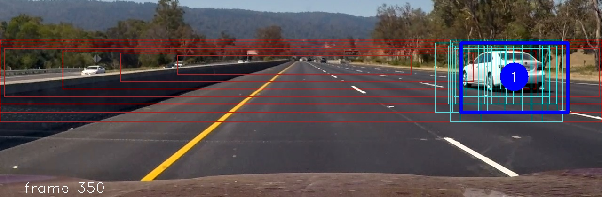
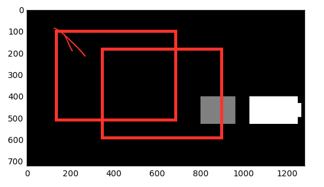

Vehicle Detection Project
--------------------------------

# 1. Histogram of Oriented Gradients (HOG)
## 1.1. HOG features and final choice of HOG parameters

get_hog_features() function in 'functions_training.py' extracts	HOG features from input images.  
This function is almost close on the code in the lesson29 as follows, and calls hog() function imported from scikit-image.

```
from skimage.feature import hog

def get_hog_features(img, orient, pix_per_cell, cell_per_block,
                     transform_sqrt=True, vis=False, feature_vec=True):
    # Call with two outputs if vis==True
    if vis is True:
        features, hog_image = hog(img, orientations=orient,
                                  pixels_per_cell=(pix_per_cell, pix_per_cell),
                                  cells_per_block=(cell_per_block, cell_per_block),
                                  transform_sqrt=transform_sqrt,
                                  visualise=vis, feature_vector=feature_vec)
        return features, hog_image
    # Otherwise call with one output
    else:
        features = hog(img, orientations=orient,
                       pixels_per_cell=(pix_per_cell, pix_per_cell),
                       cells_per_block=(cell_per_block, cell_per_block),
                       transform_sqrt=transform_sqrt,
                       visualise=vis, feature_vector=feature_vec)
        return features
```

I tried some argument values different from ones at the lesson, 
but got back again because the parameters at the lesson 29 were reasonable.

The parameters to the hog() are as follows.

| parameter name    | value             |
|:-----------------:|:-----------------:|
| orientations      | 9                 |
| pixels_per_cell   | (8, 8)            |
| cells_per_block   | (2, 2)            |
| block_norm        | L1 (default)      |
| visualise         | False             |
| transform_sqrt    | False             |
| feature_vector    | True *            |

 \* only at training process

And th hog() is called with color images as follows.

| parameter name    | value             |
|:-----------------:|:-----------------:|
| color_space       | YCrCb             |
| hog_channel       | ALL (3ch)         |

As the parameters, HOG would be calculated each 64x64 pixles images, 
and return a float64 1D array which size is (1764,) for each image color channels.  
The flatten array is from 5D array (7, 7, 2, 2, 9) which means 9 orientations x (2, 2) cells in a block x (7, 7) blocks in a 64x64 image.

It was showed the figure in the lesson 29 as follows.


## 1.2. Spatial features
I took spatial features in addition to the HOG features.

bin_spatial() function in 'functions_training.py' calculates the spatial features for the input image.
This code is quite similar to the code at lesson 35 as follows.  
And the parameter for the function is (32, 32), which is same to ones at the lesson.

```
def bin_spatial(img, size=(32, 32)):
    # Use cv2.resize().ravel() to create the feature vector
    color1 = cv2.resize(img[:, :, 0], size).ravel()
    color2 = cv2.resize(img[:, :, 1], size).ravel()
    color3 = cv2.resize(img[:, :, 2], size).ravel()
    return np.hstack((color1, color2, color3))
```

bin_spatial() function returns an uint8 1D array which size (3072,) means 32x32 spatial features x 3 color image channels.


## 1.3. Color histogram features
I took color histogram features in addition to the HOG features.

color_hist() function in 'functions_training.py' calculates the color histogram features for the input image.
This code is based on the code at lesson 35, but explicitly added 'range' argument as follows.  
And the parameters for the function are 32 for 'nbins' and (0, 255) for 'range'.

As the default of the np.histogram, the 'range' argument would be automatically set with (a.min(), a.max()).  
but I took fixed values on my code for the stability of the training.

```
def color_hist(img, nbins=64, hist_range=(0, 255)):
    # Compute the histogram of the color channels separately
    channel1_hist = np.histogram(img[:, :, 0], bins=nbins, range=hist_range)
    channel2_hist = np.histogram(img[:, :, 1], bins=nbins, range=hist_range)
    channel3_hist = np.histogram(img[:, :, 2], bins=nbins, range=hist_range)

    # Concatenate the histograms into a single feature vector
    hist_features = np.concatenate(
        (channel1_hist[0], channel2_hist[0], channel3_hist[0]))

    # Return the individual histograms, bin_centers and feature vector
    return hist_features
```

color_hist() function returns an int64 1D array which size (192,) means 64bins histograms x 3 color image channels.


## 1.4. Collecting HOG, Spatial and Color features from the training images

single_img_features() function in 'functions_training.py' put together the three types of the features into a python list for each training images.

As described above, the size of the list is 8556 (3072 for spatial, 192 for color histograms and 5292 for HOG x 3 color channels).

```
def single_img_features(image,
                        color_space='YCrCb',
                        spatial_size=(32, 32),
                        hist_bins=64, hist_range=(0, 255),
                        orient=9, pix_per_cell=8, cell_per_block=2):
    features = []
    # 1) Apply color conversion
    img = convert_color(image, conv=color_space)

    # 2) Compute spatial features
    spatial_features = bin_spatial(img, size=spatial_size)
    features.append(spatial_features)

    # 3) Compute histogram features
    hist_features = color_hist(img, nbins=hist_bins, hist_range=hist_range)
    features.append(hist_features)

    # 4) Compute HOG features
    hog_features = []
    for channel in range(img.shape[2]):
        hog_features.extend(get_hog_features(img[:, :, channel],
                                             orient, pix_per_cell, cell_per_block,
                                             transform_sqrt=False,
                                             vis=False,
                                             feature_vec=True))
    # print(len(hog_features))
    features.append(hog_features)

    return np.concatenate(features)
```

## 1.5. Features Standardization

The collected features are standardized via StandardScaler() function imported from sklearn.preprocessing at line 108 - 111 in 'project_training.py' as follows.  
StandardScaler() removes the mean and scaling to unit variance from the features.

Here, X is a np.array which contains features arrays from vehicle dataset and non-vehicle dataset provided by Udacity.

```
# Fit a per-column scaler
X_scaler = StandardScaler().fit(X)
# Apply the scaler to X
scaled_X = X_scaler.transform(X)
```

## 1.6. Dataset randomization

The normalized dataset is randomized and split via train_test_split() function imported from sklearn.model_selection
at line 117 - 119 in 'project_training.py' as follows.  
This function also split the dataset into training-set and test-set.

```
# Split up data into randomized training and test sets
rand_state = np.random.randint(0, 100)
X_train, X_test, y_train, y_test = train_test_split(scaled_X, y, test_size=0.2, random_state=rand_state)
```

## 1.7. Training a classifier

The code creates SV Classifier (SVM) with the training-set and calculates its accuracy with the test-set at line 127 - 137 in 'project_training.py' as follows.  


```
# Use a linear SVC
print('Training via SVC')
svc = LinearSVC()

t = time.time()  # Check the training time for the SVC
svc.fit(X_train, y_train)
t2 = time.time()

print('  ', round(t2 - t, 2), 'Seconds to train SVC...')
# Check the score of the SVC
print('  Test Accuracy of SVC = ', round(svc.score(X_test, y_test), 4))
```

Following log text is a sample result of the code executed.  
It shows the SVC classifier performs with high accuracy.

```
Training/Test data size: 14208 3552
Feature vector length: 8556
  using: 9 orientations 8 pixels per cell and 2 cells per block
Training via SVC
   14.16 Seconds to train SVC...
  Test Accuracy of SVC =  0.9947
```


# 2. Sliding Window Search

## 2.1. Multi-scale search area adapting Perspective-Transforming

Generally, image searching algorithms for size-unknown objects would be so heavy,
because it must search the object inside a image a lot of time 
changing its search position and window size.

Regarding Automotive purpose,
we can assume vehicles have similar size and are on the same (if the road is flat) level surface.
Therefore searching argorithm can restrict numbers of window sizes and object positions
using some relationships between vehicle's real 3D position and 2D position on the image.

Following figure shows a example of the restricted multi-scale search area.  
When objective vehicles are forward on the same lane,
searching argorithm can limit number of search positions and window sizes
as each areas located red rectangles.


Actually current code searches within 5 lanes width as follows.
(After implementations to collaborate with Lane Detection, it would restrict the width more.)
And plus, steps of distance are set non-linear but near-linear on the 2D image
so that heat map (described later) would be uniformed.


Then the searching argorithm slides only one time(nysteps==1) with one windows size for each search areas.  
In this case, it slides and searchs 8 time for 8 areas (leyers) as follows.


These search areas are calculated at set_search_area() function in 'functions_vehicle.py' as follows.

```
VIEW_WIDTH     = 3.7 * 5  # means 5 lane in meter

def set_search_area():

    global M2, M2inv, search_area

    perspective_2d = np.float32([[600, 440], [640, 440], [1105, 675], [295, 675]])
    perspective_3d = np.float32([[-1.85, 40], [1.85, 40], [1.85, 5], [-1.85, 5]])

    M2 = cv2.getPerspectiveTransform(perspective_3d, perspective_2d)
    M2inv = cv2.getPerspectiveTransform(perspective_2d, perspective_3d)

    search_area = []
    for y in distance_map:
        x = - VIEW_WIDTH / 2
        x0 = (M2[0][0] * x + M2[0][1] * y + M2[0][2]) / (M2[2][0] * x + M2[2][1] * y + M2[2][2])
        y0 = (M2[1][0] * x + M2[1][1] * y + M2[1][2]) / (M2[2][0] * x + M2[2][1] * y + M2[2][2])
        #
        x = VIEW_WIDTH / 2
        x1 = (M2[0][0] * x + M2[0][1] * y + M2[0][2]) / (M2[2][0] * x + M2[2][1] * y + M2[2][2])
        y1 = (M2[1][0] * x + M2[1][1] * y + M2[1][2]) / (M2[2][0] * x + M2[2][1] * y + M2[2][2])
        #
        search_area.append([[int(x0), int(y0)], [int(x1), int(y1)]])
```

find_cars_multiscale() function in 'functions_vehicle.py' calls find_cars() function
after calculates an actual search area in a valid pixel coordinate according to the 'search_area' as follows.

```
VEHICLE_HEIGHT = 1.5  # 1.65  # meter

def find_cars_multiscale(image, svc, X_scaler,
                         transform_sqrt, orient, pix_per_cell, cell_per_block, spatial_size, hist_bins):

    global search_area

    bbox_list = []
    for area in search_area:

        width = area[1][0] - area[0][0]
        height = int(VEHICLE_HEIGHT * width / VIEW_WIDTH)
        scale = height / 64.0

        xstart = max(area[0][0], 0)
        xstop = min(area[1][0], 1279)
        ystop = area[0][1]
        ystart = ystop - height

        bbox = find_cars(image, ystart, ystop, xstart, xstop, scale, svc, X_scaler,
                         transform_sqrt, orient, pix_per_cell, cell_per_block, spatial_size, hist_bins)
        if bbox:
            bbox_list.extend(bbox)

    return bbox_list
```

## 2.2. Reusing HOG features

HOG feature calculation is the most heavy part in the project,
so I embraced keeping and reusing HOG feature values.

find_cars() function in 'functions_vehicle.py' scales a input image array and calculates the features as follows.
This function is based on a lesson35 source, but modified to be applicable to single slide process.
(because in my project input image has 64 pixle height that original function is not applicable.)

Thus hog calculation count is controled once for one search area.

```
def find_cars(img, ystart, ystop, xstart, xstop, scale, svc, X_scaler,
              transform_sqrt, orient, pix_per_cell, cell_per_block, spatial_size, hist_bins):

    img_tosearch = img[ystart:ystop, xstart:xstop, :]
    ctrans_tosearch = convert_color(img_tosearch, conv='RGB2YCrCb')
    if scale != 1:
        imshape = ctrans_tosearch.shape
        ctrans_tosearch = cv2.resize(ctrans_tosearch,
                                     (np.int(imshape[1] / scale),
                                      np.int(imshape[0] / scale)))

    ch1 = ctrans_tosearch[:, :, 0]
    ch2 = ctrans_tosearch[:, :, 1]
    ch3 = ctrans_tosearch[:, :, 2]

    # Define blocks and steps as above
    nxblocks = (ch1.shape[1] // pix_per_cell) - cell_per_block + 1
    nyblocks = (ch1.shape[0] // pix_per_cell) - cell_per_block + 1
    # nfeat_per_block = orient * cell_per_block**2

    # 64 was the orginal sampling rate, with 8 cells and 8 pix per cell
    window = 64
    nblocks_per_window = (window // pix_per_cell) - cell_per_block + 1
    cells_per_step = 1  # Instead of overlap, define how many cells to step
    nxsteps = (nxblocks - nblocks_per_window) // cells_per_step
    nysteps = (nyblocks - nblocks_per_window) // cells_per_step
    nysteps = max(1, nysteps)

    # Compute individual channel HOG features for the entire image
    hog1 = get_hog_features(ch1, orient, pix_per_cell, cell_per_block, transform_sqrt=transform_sqrt, feature_vec=False)
    hog2 = get_hog_features(ch2, orient, pix_per_cell, cell_per_block, transform_sqrt=transform_sqrt, feature_vec=False)
    hog3 = get_hog_features(ch3, orient, pix_per_cell, cell_per_block, transform_sqrt=transform_sqrt, feature_vec=False)

    bbox = []
    for xb in range(nxsteps):
        for yb in range(nysteps):
            ypos = yb * cells_per_step
            xpos = xb * cells_per_step
            # Extract HOG for this patch
            hog_feat1 = hog1[ypos:ypos + nblocks_per_window,
                             xpos:xpos + nblocks_per_window].ravel()
            hog_feat2 = hog2[ypos:ypos + nblocks_per_window,
                             xpos:xpos + nblocks_per_window].ravel()
            hog_feat3 = hog3[ypos:ypos + nblocks_per_window,
                             xpos:xpos + nblocks_per_window].ravel()
            hog_features = np.hstack((hog_feat1, hog_feat2, hog_feat3))

            xleft = xpos * pix_per_cell
            ytop = ypos * pix_per_cell

            # Extract the image patch
            subimg = cv2.resize(ctrans_tosearch[ytop:ytop + window, xleft:xleft + window], (64, 64))

            # Get color features
            spatial_features = bin_spatial(subimg, size=spatial_size)
            hist_features = color_hist(subimg, nbins=hist_bins)

            # Scale features and make a prediction
            test_features = X_scaler.transform(np.hstack((spatial_features, hist_features, hog_features)).reshape(1, -1))
            test_prediction = svc.predict(test_features)

            if test_prediction == 1:
                xbox_left = np.int(xleft * scale + xstart)  # add offset
                ytop_draw = np.int(ytop * scale)
                win_draw = np.int(window * scale)
                bbox.append([[xbox_left, ytop_draw + ystart],
                             [xbox_left + win_draw, ytop_draw + win_draw + ystart]])

    return bbox
```

## 2.3. Heatmap of Vehicle detection

find_cars_multiscale() returns some boundary boxes that may contain a vehicle image as follows.


To select one boundary box for one vehicle, I took a heat-map method as following picture.  
Heatmap is a voting space from all candidate boundary boxes, and roles like a probability distribution of vehicle existence.


## 2.4. Heatmap FIFO and Outlier rejection

select_bbox_with_heatmap() function in 'functions_vehicle.py' holds a multi-frame heatmap and reject outliers as following code.  

```
def select_bbox_with_heatmap(image, bbox_list, threshold=4):

    global heatmap_fifo

    heatmap_cur = np.zeros_like(image[:, :, 0]).astype(np.uint8)
    add_heat(heatmap_cur, bbox_list)

    heatmap_fifo[1:FRAMENUM, :, :] = heatmap_fifo[0:FRAMENUM - 1, :, :]
    heatmap_fifo[0][:][:] = np.copy(heatmap_cur)

    heatmap_sum = np.zeros_like(image[:, :, 0]).astype(np.uint8)
    for f in range(1, FRAMENUM):
        heatmap_sum += heatmap_fifo[f][:][:]

    heatmap_sum = apply_threshold(heatmap_sum, threshold)
    labelnum, labelimg, contours, centroids = cv2.connectedComponentsWithStats(heatmap_sum)

    return labelnum, contours, centroids
```

Following picture shows current candidate boundary boxes and multi-frame heatmaps.


Then the function takes multi frame summation, 
rejects candidate pixles which voted number is lower than 'threshold',
labels it via cv2.connectedComponentsWithStats().
and returns the label number and all contour information.


Following picture shows selected boundary box for the vehicle.
Thus, by having a multi frame heatmap, most outliers could be rejected.



<!--


-->

# 3. Pipeline on a video stream

## 3.1. Pipeline Details

process_image() function in 'project_pipeline_video.py' is the pipeliine for video output.
This function calls find_cars_multiscale() and select_bbox_with_heatmap() described above.
Following code is vehicle detection part (excluded lane detection part).

```
def process_image(image):

    ....

    # 8) Vehicles Detection
    draw_img = np.copy(image)
    t1 = time.time()  # Check the training time for the SVC

    # 8-1) Sliding Windows Search
    bbox_list = find_cars_multiscale(image, svc, X_scaler, transform_sqrt, orient, pix_per_cell, cell_per_block, spatial_size, hist_bins)

    # 8-2) Update Heatmap
    labelnum, contours, centroids = select_bbox_with_heatmap(image, bbox_list, threshold=18)  # 16 - 20

    t2 = time.time()
    print('  ', round(t2 - t1, 2), 'Seconds to process a image')

    ....

    return draw_img
```


## 3.2. Final video Output with LaneLines Detection

Here's a [link to my video result](./output_images/project_video_out.mp4)

This vide contains lane-detection result.


# 4. Conclusion and Discussion

## 4.1 execution time

This vehicles detection algorithm's execution time is from 0.3 to 0.4 second per a frame on my laptop.

This improves according to some parameters like narrowing search_area and increasing overlapping of sliding window.
Because it is trade-off with the performance of the project, I didn't take them.

If reusing HOG feature between different scaled images is enable, it would be very successful.
But I have no idea to make it in cases the scale number is not integer.

## 4.2. multi-frame heatmaps cause boundary box offset

Multi-frame heatmap method has great stability, 
but also causes some offset into boundary boxes 
because past frame heatmaps affect into the summation value.

As 2nd stages detection technique,
adding small vehicle's part detection, like break-lamps or tires, 
may be good to improve the accuracy.

## 4.3. collaboration with lane detection

Not just drawing, I would like to have co-operation with lane detection.

I had some trial about it, but didn't get good result yet.
I'll implement vehicle position estimation on the road located by lane-detection.

This would be useful for vehicle tracking.


EOF.


<!--
# Dataset Prepaeration

## Project Dataset provided by Udacity
Here are links to the labeled data for vehicle and non-vehicle examples to train your classifier. 

- https://s3.amazonaws.com/udacity-sdc/Vehicle_Tracking/vehicles_smallset.zip
- https://s3.amazonaws.com/udacity-sdc/Vehicle_Tracking/non-vehicles_smallset.zip
- https://s3.amazonaws.com/udacity-sdc/Vehicle_Tracking/vehicles.zip
- https://s3.amazonaws.com/udacity-sdc/Vehicle_Tracking/non-vehicles.zip

These example images come from a combination of the GTI vehicle image database, the KITTI vision benchmark suite, 
- http://www.gti.ssr.upm.es/data/Vehicle_database.html
- http://www.cvlibs.net/datasets/kitti/
and examples extracted from the project video itself. 

- Udacity labeled dataset
You are welcome and encouraged to take advantage of the recently released Udacity labeled dataset to augment your training data.
- https://github.com/udacity/self-driving-car/tree/master/annotations

## 1 [CrowdAI](http://crowdai.com/) Dataset
imagedata http://bit.ly/udacity-annoations-crowdai

annotation list
https://github.com/udacity/self-driving-car/blob/master/annotations/labels_crowdai.csv

## 2 [Autti](http://autti.co/) Dataset
http://bit.ly/udacity-annotations-autti

## 3 Selecting Labeled Dataset

# goals / steps of this project are the following:


-->
