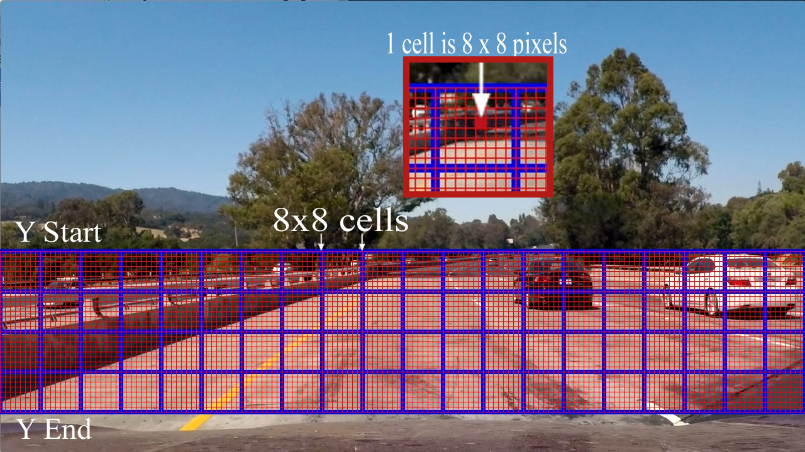
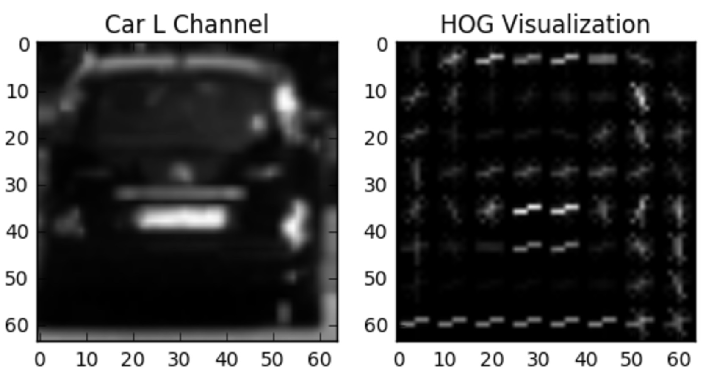

Vehicle Detection Project
--------------------------------
TODO 

- [ ] HOG特徴量で SVM Classifierを学習させる
  - [ ] 他の特徴量を加えて認識率を向上させる
  - [ ] 正規化とランダマイズを確実に施す
- [ ] sliding-window technique で車両認識を行う
  - [ ] スキャン方法と範囲を工夫して、FPと演算量を削減する
  - [ ] ☆HOG計算枠と認識の枠がズレているのを修正する
  - [ ] Perspectiveの値が実際と異なっているのを修正する 実測で → 目合せで完了
  - [ ] ゴミフィルタが機能していないのを修正する → 変数の初期化忘れ
  - [ ] スケーラの値を確認する
- [ ] ビデオファイルを作成するpipelineの説明
  - [ ] heat mapを用いて、 outlierを除外し、見付けた車両をたどる
  - [ ] 既検出の自動車をトラッキングしてFN/FPを削減する
  - [ ] 目安、10FPSまで高速化する

- [ ] Estimate a bounding box for vehicles detected.

# 1. Histogram of Oriented Gradients (HOG)
## 1.1. HOG features and final choice of HOG parameters

get_hog_features() function in 'functions_training.py' extracts	HOG features from input images.  
This function is almost close on the code in the lesson29 as follows, and calls hog() function imported from scikit-image.

```
from skimage.feature import hog

def get_hog_features(img, orient, pix_per_cell, cell_per_block,
                     transform_sqrt=True, vis=False, feature_vec=True):
    # Call with two outputs if vis==True
    if vis is True:
        features, hog_image = hog(img, orientations=orient,
                                  pixels_per_cell=(pix_per_cell, pix_per_cell),
                                  cells_per_block=(cell_per_block, cell_per_block),
                                  transform_sqrt=transform_sqrt,
                                  visualise=vis, feature_vector=feature_vec)
        return features, hog_image
    # Otherwise call with one output
    else:
        features = hog(img, orientations=orient,
                       pixels_per_cell=(pix_per_cell, pix_per_cell),
                       cells_per_block=(cell_per_block, cell_per_block),
                       transform_sqrt=transform_sqrt,
                       visualise=vis, feature_vector=feature_vec)
        return features
```

I tried some argument values different from ones at the lesson, 
but got back again because the parameters at the lesson 29 were reasonable.

The parameters to the hog() are as follows.

| parameter name    | value             |
|:-----------------:|:-----------------:|
| orientations      | 9                 |
| pixels_per_cell   | (8, 8)            |
| cells_per_block   | (2, 2)            |
| block_norm        | L1 (default)      |
| visualise         | False             |
| transform_sqrt    | False             |
| feature_vector    | True              |

And th hog() is called with color images as follows.

| parameter name    | value             |
|:-----------------:|:-----------------:|
| color_space       | YCrCb             |
| hog_channel       | ALL(3channel)     |

As the parameters, HOG would be calculated each 64x64 pixles images, 
and return a float64 1D array which size is (1764,) for each image color channels.  
The flatten array is from 5D array (7, 7, 2, 2, 9) which means 9 orientations x (2, 2) cells in a block x (7, 7) blocks in a 64x64 image.

It was showed the figure in the lesson 29 as follows.


## 1.2. Spatial features
I took spatial features in addition to the HOG features.

bin_spatial() function in 'functions_training.py' calculates the spatial features for the input image.
This code is quite similar to the code at lesson 35 as follows.  
And the parameter for the function is (32, 32), which is same to ones at the lesson.

```
def bin_spatial(img, size=(32, 32)):
    # Use cv2.resize().ravel() to create the feature vector
    color1 = cv2.resize(img[:, :, 0], size).ravel()
    color2 = cv2.resize(img[:, :, 1], size).ravel()
    color3 = cv2.resize(img[:, :, 2], size).ravel()
    return np.hstack((color1, color2, color3))
```

bin_spatial() function returns an uint8 1D array which size (3072,) means 32x32 spatial features x 3 color image channels.


## 1.3. Color histogram features
I took color histogram features in addition to the HOG features.

color_hist() function in 'functions_training.py' calculates the color histogram features for the input image.
This code is based on the code at lesson 35, but explicitly added 'range' argument as follows.  
And the parameters for the function are 32 for 'nbins' and (0, 255) for 'range'.

As the default of the np.histogram, the 'range' argument would be automatically set with (a.min(), a.max()).  
but I took fixed values on my code for the stability of the training.

```
def color_hist(img, nbins=64, hist_range=(0, 255)):
    # Compute the histogram of the color channels separately
    channel1_hist = np.histogram(img[:, :, 0], bins=nbins, range=hist_range)
    channel2_hist = np.histogram(img[:, :, 1], bins=nbins, range=hist_range)
    channel3_hist = np.histogram(img[:, :, 2], bins=nbins, range=hist_range)

    # Concatenate the histograms into a single feature vector
    hist_features = np.concatenate(
        (channel1_hist[0], channel2_hist[0], channel3_hist[0]))

    # Return the individual histograms, bin_centers and feature vector
    return hist_features
```

color_hist() function returns an int64 1D array which size (192,) means 64bins histograms x 3 color image channels.


## 1.4. Collecting HOG, Spatial and Color features from the training images

single_img_features() function in 'functions_training.py' put together the three types of the features into a python list for each training images.

As described above, the size of the list is 8556 (3072 for spatial, 192 for color histograms and 5292 for HOG x 3 color channels).

```
def single_img_features(image,
                        color_space='YCrCb',
                        spatial_size=(32, 32),
                        hist_bins=64, hist_range=(0, 255),
                        orient=9, pix_per_cell=8, cell_per_block=2):
    features = []
    # 1) Apply color conversion
    img = convert_color(image, conv=color_space)

    # 2) Compute spatial features
    spatial_features = bin_spatial(img, size=spatial_size)
    features.append(spatial_features)

    # 3) Compute histogram features
    hist_features = color_hist(img, nbins=hist_bins, hist_range=hist_range)
    features.append(hist_features)

    # 4) Compute HOG features
    hog_features = []
    for channel in range(img.shape[2]):
        hog_features.extend(get_hog_features(img[:, :, channel],
                                             orient, pix_per_cell, cell_per_block,
                                             transform_sqrt=False,
                                             vis=False,
                                             feature_vec=True))
    # print(len(hog_features))
    features.append(hog_features)

    return np.concatenate(features)
```

## 1.5. Features Normalization

The collected features are normalized via StandardScaler() function imported from sklearn.preprocessing at line 108 - 111 in 'project_training.py' as follows.  
StandardScaler() removes the mean and scaling to unit variance from the features.

Here, X is a np.array which contains features arrays from vehicle dataset and non-vehicle dataset provided by Udacity.

```
# Fit a per-column scaler
X_scaler = StandardScaler().fit(X)
# Apply the scaler to X
scaled_X = X_scaler.transform(X)
```

## 1.6. Dataset randomization

The normalized dataset is randomized and split via train_test_split() function imported from sklearn.model_selection
at line 117 - 119 in 'project_training.py' as follows.  
This function also split the dataset into training-set and test-set.

```

# Split up data into randomized training and test sets
rand_state = np.random.randint(0, 100)
X_train, X_test, y_train, y_test = train_test_split(scaled_X, y, test_size=0.2, random_state=rand_state)
```

## 1.7. Training a classifier

The code creates SVC Classifier with the training-set and calculates its accuracy with the test-set at line 127 - 137 in 'project_training.py' as follows.  

```
# Use a linear SVC
print('Training via SVC')
svc = LinearSVC()

t = time.time()  # Check the training time for the SVC
svc.fit(X_train, y_train)
t2 = time.time()

print('  ', round(t2 - t, 2), 'Seconds to train SVC...')
# Check the score of the SVC
print('  Test Accuracy of SVC = ', round(svc.score(X_test, y_test), 4))
```

Following log text is a sample result of the code executed.  
It shows the SVC classifier performs with high accuracy.

```
Training/Test data size: 14208 3552
Feature vector length: 8556
  using: 9 orientations 8 pixels per cell and 2 cells per block
Training via SVC
   14.16 Seconds to train SVC...
  Test Accuracy of SVC =  0.9947
```


# 2. Sliding Window Search


```
Search Area:
  7 : (  -386.6,  +545.5) - ( +1698.4,  +545.5)
  8 : (  -178.5,  +521.1) - ( +1473.7,  +521.1)
  9 : (   -42.0,  +505.0) - ( +1326.3,  +505.0)
 10 : (   +54.5,  +493.7) - ( +1222.1,  +493.7)
 11 : (  +126.3,  +485.3) - ( +1144.5,  +485.3)
 13 : (  +226.0,  +473.6) - ( +1036.8,  +473.6)
 17 : (  +338.9,  +460.3) - (  +915.0,  +460.3)
 23 : (  +422.7,  +450.5) - (  +824.4,  +450.5)
 30 : (  +473.1,  +444.6) - (  +770.0,  +444.6)
frameno:     0
( 1279 x 156 ) ->  (12, 105, 2, 2, 9) float64
( 1279 x 123 ) ->  (9, 105, 2, 2, 9) float64
( 1279 x 102 ) ->  (7, 105, 2, 2, 9) float64
( 1168 x 87 ) ->  (6, 96, 2, 2, 9) float64
( 1018 x 76 ) ->  (5, 83, 2, 2, 9) float64
( 810 x 60 ) ->  (4, 66, 2, 2, 9) float64
( 576 x 43 ) ->  (2, 47, 2, 2, 9) float64
( 402 x 30 ) ->  (1, 32, 2, 2, 9) float64
( 296 x 22 ) ->  (0, 23, 2, 2, 9) float64
   0.39 Seconds to process a image

frameno:     0
( 1279 x 156 ) ->  (12, 105, 2, 2, 9) float64
( 1279 x 123 ) ->  (12, 105, 2, 2, 9) float64
( 1279 x 102 ) ->  (12, 105, 2, 2, 9) float64
( 1168 x 87 ) ->  (12, 105, 2, 2, 9) float64
( 1018 x 76 ) ->  (12, 105, 2, 2, 9) float64
( 810 x 60 ) ->  (12, 105, 2, 2, 9) float64
( 576 x 43 ) ->  (12, 105, 2, 2, 9) float64
( 402 x 30 ) ->  (12, 105, 2, 2, 9) float64
( 296 x 22 ) ->  (12, 105, 2, 2, 9) float64
```


# 2. HOG feature and Other Features to Detect Vehicles

Explain how you settled on your final choice of HOG parameters.

- For each channel and with your HOG parameters above, the HOG feature vector is 1764 long
- The spatial binning feature vector is 32 x 32 x 3 = 3072 long -> 16 x 16 x 3 = 768
- The histogram feature vector is 32 x 3 = 96
- Therefore, using only 1 HOG channel gives you a 1764 + 3072 + 96 = 4932 vector.
  This is one of the dimensions quoted by the error message.
- But your find_cars() function uses all 3 HOG channels -- see these lines:

Therefore the resulting HOG feature vector is 1764 x 3 = 5292. 
Add to that the spatial and histogram features and you get 5292 + 3072 + 96 = 8460, 
which is the other number quoted by the error message.




<!--


-->


## Option
- color transform 
- binned color features
- histograms of color

# 3. Training with Linear SVM classifier

I took Udacity provided dataset to classify vehicles.

# 4. Sliding-Window Technique and Vehicle Tracking
# 5. Rejecting Outliers and follow detected vehicles.
Heat-map Creation of recurring detections frame by frame 
rejecting outliers and follow detected vehicles.
Estimate a bounding box for vehicles detected.

# 6. Run pipeline on a video stream
start with the test_video.mp4 and later implement on full project_video.mp4

## Udacity provided Video

test_video.mp4

project_video.mp4

<!--
## Hakone Video

60MB 比較的車が多い
LegacyVideo_05_40_20170725_135613.mp4

205MB 後半に工事車両
LegacyVideo_05_40_20170725_140502

621MB 霧、ワイパー
LegacyVideo_05_40_20170725_144407
-->


# 7. Conclusion and Discussion


  ** Don't forget to normalize your features and randomize **

<!--
# Sample Writeup

## test_images:
Some example images for testing your pipeline on single frames are located in the test_images folder. 

## ouput_images
To help the reviewer examine your work, 
please save examples of the output from each stage of your pipeline in the folder called ouput_images, 
and include them in your writeup for the project by describing what each image shows. 

## input videos
The video called project_video.mp4 is the video your pipeline should work well on.

As an optional challenge Once you have a working pipeline for vehicle detection, 
add in your lane-finding algorithm from the last project to do simultaneous lane-finding and vehicle detection!

If you're feeling ambitious (also totally optional though), 
don't stop there! We encourage you to go out and take video of your own, 
and show us how you would implement this project on a new video!


[//]: # (Image References)
[image1]: ./examples/car_not_car.png
[image2]: ./examples/HOG_example.jpg
[image3]: ./examples/sliding_windows.jpg
[image4]: ./examples/sliding_window.jpg
[image5]: ./examples/bboxes_and_heat.png
[image6]: ./examples/labels_map.png
[image7]: ./examples/output_bboxes.png
[video1]: ./project_video.mp4


# Histogram of Oriented Gradients (HOG)

## 1. Explain how (and identify where in your code) you extracted HOG features from the training images.

The code for this step is contained in the first code cell of the IPython notebook (or in lines # through # of the file called `some_file.py`).  

I started by reading in all the `vehicle` and `non-vehicle` images.  Here is an example of one of each of the `vehicle` and `non-vehicle` classes:

![alt text][image1]

I then explored different color spaces and different `skimage.hog()` parameters (`orientations`, `pixels_per_cell`, and `cells_per_block`).  I grabbed random images from each of the two classes and displayed them to get a feel for what the `skimage.hog()` output looks like.

Here is an example using the `YCrCb` color space and HOG parameters of `orientations=8`, `pixels_per_cell=(8, 8)` and `cells_per_block=(2, 2)`:


![alt text][image2]

## 2. Explain how you settled on your final choice of HOG parameters.

I tried various combinations of parameters and...

## 3. Describe how (and identify where in your code) you trained a classifier using your selected HOG features (and color features if you used them).

I trained a linear SVM using...

# Sliding Window Search

## 1. Describe how (and identify where in your code) you implemented a sliding window search.  How did you decide what scales to search and how much to overlap windows?

I decided to search random window positions at random scales all over the image and came up with this (ok just kidding I didn't actually ;):

![alt text][image3]

## 2. Show some examples of test images to demonstrate how your pipeline is working.  What did you do to optimize the performance of your classifier?

Ultimately I searched on two scales using YCrCb 3-channel HOG features plus spatially binned color and histograms of color in the feature vector, which provided a nice result.  Here are some example images:

![alt text][image4]

# Video Implementation

## 1. Provide a link to your final video output.  Your pipeline should perform reasonably well on the entire project video (somewhat wobbly or unstable bounding boxes are ok as long as you are identifying the vehicles most of the time with minimal false positives.)
Here's a [link to my video result](./project_video.mp4)


## 2. Describe how (and identify where in your code) you implemented some kind of filter for false positives and some method for combining overlapping bounding boxes.

I recorded the positions of positive detections in each frame of the video.  From the positive detections I created a heatmap and then thresholded that map to identify vehicle positions.  I then used `scipy.ndimage.measurements.label()` to identify individual blobs in the heatmap.  I then assumed each blob corresponded to a vehicle.  I constructed bounding boxes to cover the area of each blob detected.  

Here's an example result showing the heatmap from a series of frames of video, the result of `scipy.ndimage.measurements.label()` and the bounding boxes then overlaid on the last frame of video:

# Here are six frames and their corresponding heatmaps:

![alt text][image5]

# Here is the output of `scipy.ndimage.measurements.label()` on the integrated heatmap from all six frames:
![alt text][image6]

# Here the resulting bounding boxes are drawn onto the last frame in the series:
![alt text][image7]


# Discussion

## 1. Briefly discuss any problems / issues you faced in your implementation of this project.  Where will your pipeline likely fail?  What could you do to make it more robust?

Here I'll talk about the approach I took, what techniques I used, what worked and why, where the pipeline might fail and how I might improve it if I were going to pursue this project further.  

-->

<!--
# Dataset Prepaeration

## Project Dataset provided by Udacity
Here are links to the labeled data for vehicle and non-vehicle examples to train your classifier. 

- https://s3.amazonaws.com/udacity-sdc/Vehicle_Tracking/vehicles_smallset.zip
- https://s3.amazonaws.com/udacity-sdc/Vehicle_Tracking/non-vehicles_smallset.zip
- https://s3.amazonaws.com/udacity-sdc/Vehicle_Tracking/vehicles.zip
- https://s3.amazonaws.com/udacity-sdc/Vehicle_Tracking/non-vehicles.zip

These example images come from a combination of the GTI vehicle image database, the KITTI vision benchmark suite, 
- http://www.gti.ssr.upm.es/data/Vehicle_database.html
- http://www.cvlibs.net/datasets/kitti/
and examples extracted from the project video itself. 

- Udacity labeled dataset
You are welcome and encouraged to take advantage of the recently released Udacity labeled dataset to augment your training data.
- https://github.com/udacity/self-driving-car/tree/master/annotations

## 1 [CrowdAI](http://crowdai.com/) Dataset
imagedata http://bit.ly/udacity-annoations-crowdai

annotation list
https://github.com/udacity/self-driving-car/blob/master/annotations/labels_crowdai.csv

## 2 [Autti](http://autti.co/) Dataset
http://bit.ly/udacity-annotations-autti

## 3 Selecting Labeled Dataset

# goals / steps of this project are the following:


-->
